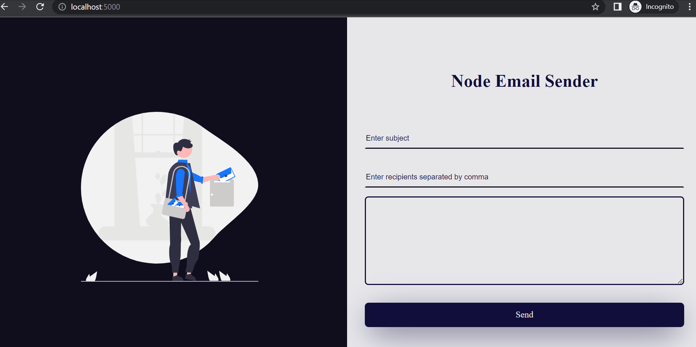

## Node Email Sender

> Send Email using NodeJs and Nodemailer



## Built With 🌩️

- ExpressJS
- Pug --Template Engine

## Live Demo ☁️

[Live Demo Link](https://node-email-sender-webq.onrender.com/

## Getting Started ☀️

To get a local copy up and running follow these simple example steps.

### Prerequisites

Install Node and npm using the `npm install` command on your command line, then install yarn using `npm install --global yarn`.

### Setup

Clone this repository by typing `git clone https://github.com/ikechukwu-peter/node-email-sender.git` on your terminal.

## Installation

```bash
$ yarn install
```

## Running the app

```bash
# development
$ yarn dev

# development static files
$ yarn watch

# build
$ yarn build

# start
$ yarn start

# lint
$ yarn lint

# format
$ yarn format

```

### Usage

Navigate to the project directory `cd node-email-sender`, open two terminals and run `yarn dev` in one and then `yarn watch` in the other. The `yarn watch` compiled your client TypeScript to JavaScript and watches for file changes. Or, visit the live demo at: https://node-email-sender-webq.onrender.com/

## Author

👤 **Ikechukwu Peter**

- GitHub: [@ikechukwu-peter](https://github.com/ikechukwu-peter)
- Twitter: [@pete_iyke](https://twitter.com/pete_iyke)
- LinkedIn: [LinkedIn](https://www.linkedin.com/in/peter-ikechukwu/)

## Show your support

Give a ⭐️ if you like this project!

## 📝 License

This project is [MIT](LICENSE) licensed.
